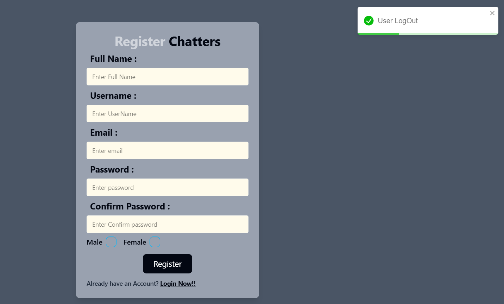
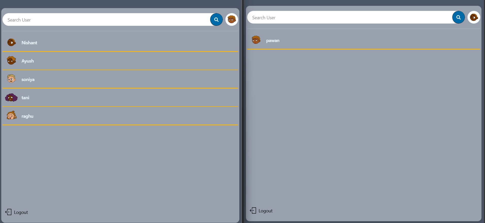
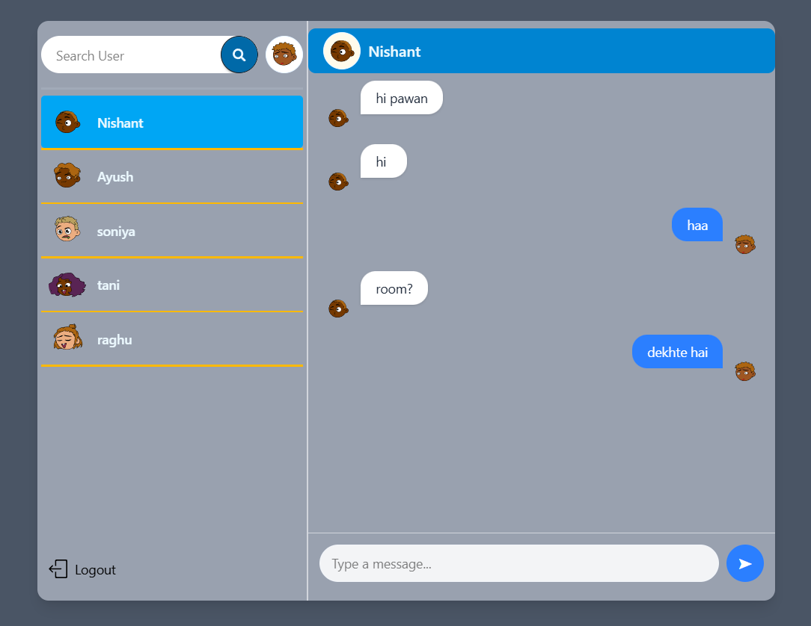

# 💬 Chat Application

A real-time chat application built using the **MERN Stack** (MongoDB, Express, React, Node.js) and **Socket.io** for instant messaging functionality.

---

## 📸 Screenshots

| Registration / Login | Dual Window Chat View | Single Window Chat View |
| --- | --- | --- |
|  |  |  |

---

## 🚀 Features

*   **Authentication & Authorization:** Secure user registration and login flows.
*   **JWT (JSON Web Tokens):** Token-based secure state-handling and route protection.
*   **Session Management:** Persistent login states along with a dedicated **Logout** mechanism.
*   **Real-time Communication:** Instant, low-latency messaging powered by **Socket.io**.
*   **Robust Backend:** Clean, modular structure using a production-ready `src/` directory layout.

---

## 🛠️ Tech Stack

*   **Frontend:** React.js, HTML5, CSS3,TailwindCss JavaScript
*   **Backend:** Node.js, Express.js
*   **Database:** MongoDB Atlas (Cloud)
*   **Real-time Protocol:** Socket.io
*   **Security:** JSON Web Tokens (JWT), Bcrypt for password hashing

---

## ⚙️ Project Structure

```text
├── backend/
│   ├── src/
│   │   ├── config/       # Database configuration & environment setup
│   │   ├── controller/   # Business logic (auth, messages, etc.)
│   │   ├── middleware/   # JWT verification & route protection
│   │   ├── models/       # Mongoose schemas (user, message, etc.)
│   │   ├── routes/       # Express API route definitions
│   │   ├── socket/       # Socket.io configuration for real-time events
│   │   └── server.js     # App entry point
│   ├── .env              # Environment variables (Hidden via .gitignore)
│   ├── package.json      # Backend dependencies
│   └── node_modules/     # Installed node packages
├── frontend/             # React Client application
├── screenshots/          # Application UI screenshots
└── .gitignore            # Ignored files configuration
